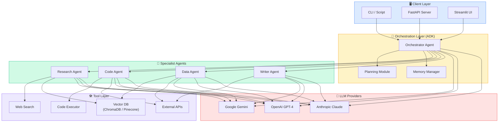

<div align="center">

# 🤖 NW Agentic Demos

### A curated showcase of production-ready Agentic AI patterns built with the Agent Development Kit (ADK)

[](https://opensource.org/licenses/MIT)
[](https://www.python.org/downloads/)
[](https://google.github.io/adk-docs/)
[](docs/CONTRIBUTING.md)
[](https://github.com/niteshwalia0124/nw-agentic-demos)

</div>

---

## 📖 Overview

This repository is a **living portfolio** of agentic AI demos covering the most impactful patterns in the field — from multi-agent orchestration and retrieval-augmented generation to autonomous research pipelines and tool-using agents.

Each demo is **self-contained**, **well-documented**, and comes with architecture diagrams, setup instructions, and example runs so you can understand, run, and extend every pattern quickly.

> **Built with:** [Google Agent Development Kit (ADK)](https://google.github.io/adk-docs/) · Python 3.10+ · LangChain · LlamaIndex · FastAPI

---

## 🗂️ Repository Structure

```
nw-agentic-demos/
├── README.md                        ← You are here
├── docs/
│   ├── ARCHITECTURE.md              ← System-level architecture
│   ├── GETTING_STARTED.md           ← Installation & setup guide
│   └── CONTRIBUTING.md              ← How to contribute
└── demos/
    ├── 01-multi-agent-orchestration/ ← Orchestrator + specialist agents
    ├── 02-rag-agent/                 ← Retrieval-Augmented Generation agent
    ├── 03-tool-using-agent/          ← Agents with external tool integrations
    ├── 04-conversational-agent/      ← Stateful multi-turn chat agent
    └── 05-autonomous-research-agent/ ← End-to-end autonomous research pipeline
```

---

## 🚀 Demo Catalogue

| # | Demo | Pattern | Key Technologies | Difficulty |
|---|------|---------|-----------------|------------|
| 01 | [Multi-Agent Orchestration](demos/01-multi-agent-orchestration/) | Orchestrator ↔ Specialist Agents | ADK, Sub-agents, Message passing | ⭐⭐⭐ |
| 02 | [RAG Agent](demos/02-rag-agent/) | Retrieval-Augmented Generation | ADK, Vector DB, Embeddings | ⭐⭐ |
| 03 | [Tool-Using Agent](demos/03-tool-using-agent/) | ReAct + External APIs | ADK, REST APIs, Function calling | ⭐⭐ |
| 04 | [Conversational Agent](demos/04-conversational-agent/) | Stateful multi-turn dialogue | ADK, Session management, Memory | ⭐ |
| 05 | [Autonomous Research Agent](demos/05-autonomous-research-agent/) | Plan → Search → Synthesize | ADK, Web search, Report generation | ⭐⭐⭐⭐ |

---

## 🏗️ High-Level Architecture

The diagram below shows how the different agentic patterns in this repo relate to each other and to the shared infrastructure layer.



---

## ⚡ Quick Start

### Prerequisites

| Requirement | Version |
|-------------|---------|
| Python | 3.10 or higher |
| pip | 23+ |
| Google ADK | latest |
| API Key | Gemini / OpenAI / Anthropic |

### 1. Clone the repository

```bash
git clone https://github.com/niteshwalia0124/nw-agentic-demos.git
cd nw-agentic-demos
```

### 2. Set up a virtual environment

```bash
python -m venv .venv
source .venv/bin/activate   # Windows: .venv\Scripts\activate
```

### 3. Install ADK and common dependencies

```bash
pip install google-adk
```

### 4. Configure your API key

```bash
export GOOGLE_API_KEY="your-gemini-api-key"
# or copy .env.example to .env and fill in your keys
```

### 5. Run a demo

```bash
cd demos/01-multi-agent-orchestration
adk run agent.py
```

📖 Full setup walkthrough → [docs/GETTING_STARTED.md](docs/GETTING_STARTED.md)

---

## 🔍 Deep-Dive Demos

### 01 · Multi-Agent Orchestration

> _"One agent to rule them all — and delegate wisely."_

An orchestrator agent breaks down complex tasks and routes sub-tasks to specialist agents (research, coding, writing). Demonstrates **dynamic planning**, **agent-to-agent messaging**, and **result aggregation**.

[→ View Demo](demos/01-multi-agent-orchestration/README.md)

---

### 02 · RAG Agent

> _"Grounded answers from your own documents."_

A retrieval-augmented agent ingests a document corpus into a vector database and answers questions with cited, grounded responses. Demonstrates **embedding pipelines**, **semantic search**, and **context injection**.

[→ View Demo](demos/02-rag-agent/README.md)

---

### 03 · Tool-Using Agent

> _"An agent that acts, not just talks."_

A ReAct-style agent equipped with real-world tools: web search, a calculator, a weather API, and a code executor. Demonstrates **function calling**, **tool selection**, and **error recovery**.

[→ View Demo](demos/03-tool-using-agent/README.md)

---

### 04 · Conversational Agent

> _"Memory, persona, and natural flow."_

A stateful chat agent with persistent session memory, configurable persona, and smooth multi-turn conversation handling. Demonstrates **session management**, **context windowing**, and **persona injection**.

[→ View Demo](demos/04-conversational-agent/README.md)

---

### 05 · Autonomous Research Agent

> _"Give it a question, get back a report."_

A fully autonomous pipeline that takes a research question, plans sub-queries, searches the web, synthesises findings, and produces a structured markdown report — no human in the loop. Demonstrates **autonomous planning**, **information synthesis**, and **long-horizon task completion**.

[→ View Demo](demos/05-autonomous-research-agent/README.md)

---

## 📐 Design Principles

| Principle | How it's applied |
|-----------|-----------------|
| **Modularity** | Each demo is self-contained with its own dependencies and README |
| **Observability** | Every agent logs its reasoning steps and tool calls |
| **Reproducibility** | Pinned dependencies and `.env.example` files in every demo |
| **Extensibility** | Clear interfaces for swapping LLM providers and tools |
| **Safety** | Guardrails and sandboxed code execution where applicable |

---

## 📚 Documentation

| Document | Description |
|----------|-------------|
| [Architecture](docs/ARCHITECTURE.md) | System-level design, component diagrams, data flow |
| [Getting Started](docs/GETTING_STARTED.md) | Full installation and configuration guide |
| [Contributing](docs/CONTRIBUTING.md) | How to add a new demo or improve existing ones |

---

## 🌟 Why ADK?

[Google's Agent Development Kit (ADK)](https://google.github.io/adk-docs/) provides:

- ✅ **First-class multi-agent support** — composable agent hierarchies out of the box
- ✅ **Built-in tool library** — web search, code execution, file I/O, and more
- ✅ **Session & memory management** — persistent state across turns
- ✅ **Model-agnostic** — swap Gemini, GPT-4, or Claude with one line
- ✅ **Evaluation framework** — measure agent quality with built-in evals

---

## 🤝 Contributing

Contributions are welcome! Whether it's a new demo, a bug fix, or a documentation improvement, please read the [Contributing Guide](docs/CONTRIBUTING.md) first.

```
Fork → Branch → Code → Test → PR
```

---

## 📄 License

This project is licensed under the [MIT License](LICENSE).

---

<div align="center">

**Built with ❤️ by [Nitesh Walia](https://github.com/niteshwalia0124)**

_If you find this repository useful, please consider giving it a ⭐_

</div>
