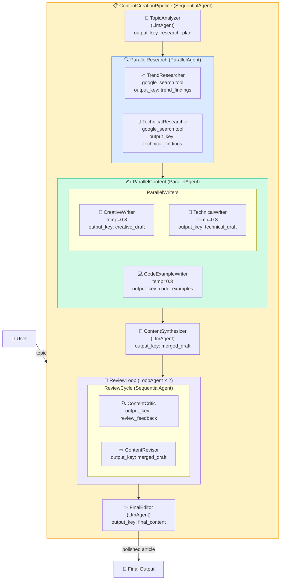

# Demo 01 — Multi-Agent Orchestration

> A content creation pipeline that showcases **all four ADK orchestration primitives** — `SequentialAgent`, `ParallelAgent`, `LoopAgent`, and `LlmAgent` — to turn a user-supplied topic into a polished article.

---

## Overview

This demo builds a **Content Creation Pipeline** using ADK's multi-agent orchestration. Given a topic, the pipeline automatically:

1. **Analyses** the topic and creates a research plan
2. **Researches** the topic in parallel (trends + technical depth) using Google Search
3. **Writes** creative content, technical content, and code examples in parallel
4. **Synthesises** all drafts into a single cohesive article
5. **Reviews** the article iteratively (critique → revise loop)
6. **Polishes** the final output for publication

This pattern is ideal for complex workflows that require multiple distinct skills working together — such as content creation, report generation, or code documentation pipelines.

---

## Architecture



---

## What You'll Learn

- How to compose agents using `SequentialAgent`, `ParallelAgent`, and `LoopAgent`
- How to pass data between agents using `output_key` and ADK state interpolation
- How to use `before_model_callback` to initialise shared pipeline state
- How to configure `GenerateContentConfig` for different temperature settings
- How to use ADK's built-in `google_search` tool for web research
- How to implement an iterative review loop with `LoopAgent`
- How to separate instruction prompts into a dedicated module

---

## Key ADK Patterns Demonstrated

| Pattern | Where | Purpose |
|---------|-------|---------|
| `SequentialAgent` | Root pipeline, Review cycle | Run stages in order |
| `ParallelAgent` | Research phase, Content phase | Run independent agents concurrently |
| `LoopAgent` | Review loop | Iterate critique→revise N times |
| `LlmAgent` | All specialist agents | LLM-powered task execution |
| `output_key` | Every LlmAgent | Persist output to shared state |
| `before_model_callback` | TopicAnalyzer | Initialise pipeline state |
| `GenerateContentConfig` | Writers, CodeAgent | Control temperature/creativity |
| `google_search` | Research agents | Built-in web search tool |
| State interpolation | All prompts | `{state_key}` references in instructions |

---

## Prerequisites

- Google ADK installed ([Getting Started](../../docs/GETTING_STARTED.md))
- `GOOGLE_API_KEY` set in your environment or `.env`

---

## Setup

```bash
cd demos/01-multi-agent-orchestration
pip install -r requirements.txt
cp .env.example .env
# Edit .env and add your Gemini API key
```

---

## Running the Demo

```bash
adk run agent.py
```

Or in terminal mode:

```bash
adk run --no-ui agent.py
```

---

## Example Interaction

```
You: Write an article about how transformer architectures work,
     with a Python implementation of multi-head attention.

[TopicAnalyzer] Creating research plan...
  → research_plan: "1. Transformer architecture overview..."

[ParallelResearch]
  [TrendResearcher] Searching for transformer trends...
    → trend_findings: "Recent developments include..."
  [TechnicalResearcher] Searching for technical details...
    → technical_findings: "The transformer architecture uses..."

[ParallelContent]
  [CreativeWriter] Writing engaging introduction...
    → creative_draft: "Imagine a world where machines..."
  [TechnicalWriter] Writing technical explanation...
    → technical_draft: "The transformer architecture consists of..."
  [CodeExampleWriter] Writing Python implementation...
    → code_examples: "class MultiHeadAttention:..."

[ContentSynthesizer] Merging all drafts...
  → merged_draft: "# Transformers: From Theory to Code..."

[ReviewLoop] Iteration 1/2
  [ContentCritic] Rating: 7/10. Suggestions: ...
  [ContentRevisor] Addressing feedback...
[ReviewLoop] Iteration 2/2
  [ContentCritic] Rating: 9/10. Minor polish needed...
  [ContentRevisor] Final revisions...

[FinalEditor] Polishing final output...
  → final_content: "# Transformers: From Theory to Code
     A Complete Guide with Python Implementation..."
```

---

## Project Structure

```
01-multi-agent-orchestration/
├── __init__.py               ← Package init (exports agent module)
├── agent.py                  ← Root pipeline (SequentialAgent) + synthesis/editing agents
├── agents/
│   ├── __init__.py           ← Exports composite agents
│   ├── research_agent.py     ← ParallelAgent: trend + technical researchers
│   ├── code_agent.py         ← LlmAgent: code example writer
│   ├── writer_agent.py       ← ParallelAgent: creative + technical writers
│   └── reviewer_agent.py     ← LoopAgent: critic + revisor review cycle
├── prompts/
│   ├── __init__.py           ← Exports all instruction constants
│   └── instructions.py       ← All agent instruction prompts
├── tools/
│   ├── __init__.py           ← Package init
│   └── web_search.py         ← Legacy SerpAPI search (optional fallback)
├── requirements.txt
├── .env.example
└── README.md
```

---

## State Flow

The pipeline passes data between agents through ADK's shared state. Each agent
reads from upstream state keys and writes to its own `output_key`:

```
User Input
  ↓
TopicAnalyzer → research_plan
  ↓
TrendResearcher → trend_findings    ┐
TechnicalResearcher → technical_findings ┘ (parallel)
  ↓
CreativeWriter → creative_draft     ┐
TechnicalWriter → technical_draft   │ (parallel)
CodeExampleWriter → code_examples   ┘
  ↓
ContentSynthesizer → merged_draft
  ↓
ContentCritic → review_feedback  ┐
ContentRevisor → merged_draft    ┘ (loop × 2)
  ↓
FinalEditor → final_content
```

---

## Extending This Demo

- **Add a fact-checking agent** that verifies claims in the final output
- **Add a SEO agent** that optimises headings and keywords
- **Increase review iterations** by changing `MAX_REVIEW_ITERATIONS` in `reviewer_agent.py`
- **Swap models** per agent (e.g. use `gemini-2.5-pro` for the editor)
- **Add memory** so the pipeline remembers past articles across sessions
- **Add guardrails** with `before_model_callback` to validate inputs

---

## Related Demos

- [Demo 02 — RAG Agent](../02-rag-agent/) — Retrieval-augmented generation
- [Demo 03 — Tool-Using Agent](../03-tool-using-agent/) — External tool integrations
- [Demo 04 — Conversational Agent](../04-conversational-agent/) — Stateful multi-turn chat
