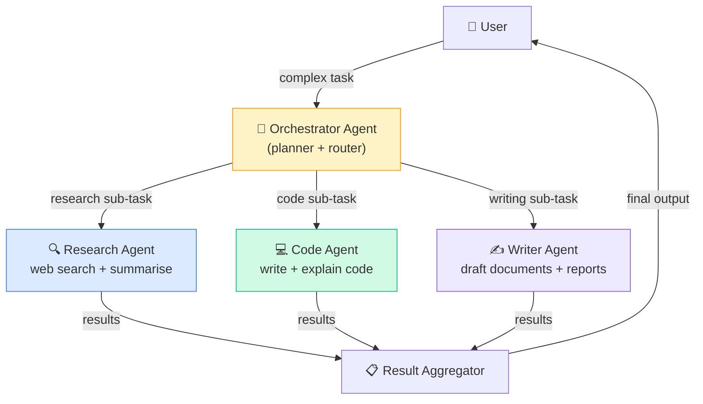

# Demo 01 — Multi-Agent Orchestration

> An orchestrator agent dynamically decomposes complex tasks and delegates sub-tasks to specialist agents, aggregating their results into a coherent final output.

---

## Overview

This demo showcases a **hierarchical multi-agent system** built with ADK. A central orchestrator agent receives a high-level user request, breaks it into sub-tasks using an LLM-powered planner, and routes each sub-task to one of three specialist agents: a **Research Agent**, a **Code Agent**, or a **Writer Agent**.

This pattern is ideal for tasks that require multiple distinct skills — for example: "Research recent advances in transformer architectures, write example Python code, and summarise it all into a blog post."

---

## Architecture



---

## What You'll Learn

- How to define an orchestrator agent that delegates to sub-agents using ADK
- How to pass context between agents with ADK's message-passing API
- How to aggregate and post-process results from multiple specialist agents
- How to implement a simple task planner within an LLM agent

---

## Prerequisites

- Google ADK installed ([Getting Started](../../docs/GETTING_STARTED.md))
- `GOOGLE_API_KEY` set in your environment or `.env`
- Optional: `SERPAPI_KEY` for live web search in the Research Agent

---

## Setup

```bash
cd demos/01-multi-agent-orchestration
pip install -r requirements.txt
cp .env.example .env
# Edit .env and add your API keys
```

---

## Running the Demo

```bash
adk run agent.py
```

Or in terminal mode:

```bash
adk run --no-ui agent.py
```

---

## Example Interaction

```
You: Research how transformers work, write a Python implementation of
     multi-head attention, and summarise everything in a short blog post.

Orchestrator: I'll break this into three sub-tasks and delegate them.

[Research Agent] Searching for transformer architecture explanations...
[Research Agent] Found 5 relevant sources. Summarising...

[Code Agent] Writing multi-head attention implementation...
[Code Agent] Code complete. Added docstrings and type hints.

[Writer Agent] Drafting blog post with research findings and code...
[Writer Agent] Draft complete.

Orchestrator: Here is the final output:
─────────────────────────────────────────
## Transformers: From Theory to Code

Transformers are ...
[full blog post with embedded code]
─────────────────────────────────────────
```

---

## Project Structure

```
01-multi-agent-orchestration/
├── agent.py              ← Orchestrator agent definition
├── agents/
│   ├── research_agent.py ← Research specialist
│   ├── code_agent.py     ← Code specialist
│   └── writer_agent.py   ← Writing specialist
├── tools/
│   └── web_search.py     ← SerpAPI web search tool
├── requirements.txt
├── .env.example
└── README.md
```

---

## Key Concepts

| Concept | Where to find it |
|---------|-----------------|
| Sub-agent definition | `agents/research_agent.py` |
| Orchestrator routing logic | `agent.py` — `route_task()` |
| Inter-agent message passing | `agent.py` — ADK `AgentMessage` |
| Result aggregation | `agent.py` — `aggregate_results()` |
| Dynamic task planning | `agent.py` — `plan_task()` |

---

## Extending This Demo

- Add a **QA Agent** that reviews the final output for factual accuracy
- Add a **Memory layer** so the orchestrator remembers completed sub-tasks across sessions
- Replace the static routing logic with a learned router trained on task descriptions
- Add parallel execution of independent sub-tasks using `asyncio`

---

## Related Demos

- [Demo 02 — RAG Agent](../02-rag-agent/) — used internally by the Research Agent
- [Demo 03 — Tool-Using Agent](../03-tool-using-agent/) — used by the Code Agent
