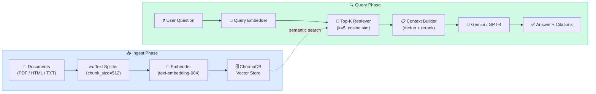

# Demo 02 — RAG Agent

> A retrieval-augmented generation agent that ingests your documents into a vector database and answers questions with grounded, cited responses.

---

## Overview

This demo implements a **Retrieval-Augmented Generation (RAG)** agent using ADK and ChromaDB. The agent first ingests a document corpus (PDF, HTML, or plain text), stores chunks in a vector database, and then answers user questions by retrieving the most semantically relevant chunks and injecting them into the LLM's prompt.

Responses include **source citations** so users know exactly which document and passage the answer was derived from.

---

## Architecture



---

## What You'll Learn

- How to build an ingestion pipeline: load → split → embed → store
- How to perform semantic similarity search with ChromaDB
- How to inject retrieved context into an ADK agent's prompt
- How to generate grounded answers with source citations
- How to tune retrieval quality with chunk size and top-k parameters

---

## Prerequisites

- Google ADK installed ([Getting Started](../../docs/GETTING_STARTED.md))
- `GOOGLE_API_KEY` set in your environment or `.env`
- Python 3.10+

---

## Setup

```bash
cd demos/02-rag-agent
pip install -r requirements.txt
cp .env.example .env
# Edit .env and add your GOOGLE_API_KEY
```

To ingest sample documents (provided in `sample_docs/`):

```bash
python ingest.py --docs sample_docs/
```

---

## Running the Demo

```bash
adk run agent.py
```

---

## Example Interaction

```
[Ingesting 3 documents into ChromaDB...]
✅ Ingested: transformer_paper.pdf   (42 chunks)
✅ Ingested: attention_blog.html     (18 chunks)
✅ Ingested: bert_overview.txt       (11 chunks)
Vector store ready. Total chunks: 71

You: What is the role of positional encoding in transformers?

Agent: [Retrieving top-5 relevant chunks...]

Positional encoding in transformers serves to inject information about
the order of tokens in the sequence, since the self-attention mechanism
is inherently permutation-invariant.

The original "Attention Is All You Need" paper uses a combination of
sine and cosine functions of different frequencies:

  PE(pos, 2i)   = sin(pos / 10000^(2i/d_model))
  PE(pos, 2i+1) = cos(pos / 10000^(2i/d_model))

This allows the model to learn relative positions via linear transformations.

Sources:
  [1] transformer_paper.pdf — Section 3.5, p.6
  [2] attention_blog.html — "Positional Encoding Explained"
```

---

## Project Structure

```
02-rag-agent/
├── agent.py            ← ADK RAG agent definition
├── ingest.py           ← Document ingestion script
├── retriever.py        ← ChromaDB retrieval logic
├── sample_docs/        ← Sample documents for demo
│   ├── sample1.txt
│   └── sample2.txt
├── requirements.txt
├── .env.example
└── README.md
```

---

## Key Concepts

| Concept | Where to find it |
|---------|-----------------|
| Document loading & splitting | `ingest.py` — `load_and_split()` |
| Embedding generation | `ingest.py` — `embed_chunks()` |
| Vector store operations | `retriever.py` — `ChromaRetriever` |
| Context injection into prompt | `agent.py` — `build_prompt()` |
| Citation extraction | `agent.py` — `format_sources()` |

---

## Configuration

The following parameters can be tuned via environment variables:

| Parameter | Default | Description |
|-----------|---------|-------------|
| `CHUNK_SIZE` | `512` | Token size for text splitting |
| `CHUNK_OVERLAP` | `64` | Overlap between chunks |
| `TOP_K` | `5` | Number of chunks to retrieve |
| `CHROMA_PERSIST_DIR` | `./chroma_db` | Where to store the vector DB |
| `EMBEDDING_MODEL` | `text-embedding-004` | Google embedding model |

---

## Extending This Demo

- Add a **re-ranker** (e.g., Cohere Rerank) to improve retrieval quality
- Add **hybrid search** (BM25 + semantic) for better coverage on exact-match queries
- Add a **self-query retriever** that extracts metadata filters from the question
- Support ingestion of web URLs in addition to local files
- Add **answer confidence scores** and fallback when no relevant context is found

---

## Related Demos

- [Demo 01 — Multi-Agent Orchestration](../01-multi-agent-orchestration/) — uses this RAG agent as the Research Agent
- [Demo 05 — Autonomous Research Agent](../05-autonomous-research-agent/) — builds on RAG for live web retrieval
