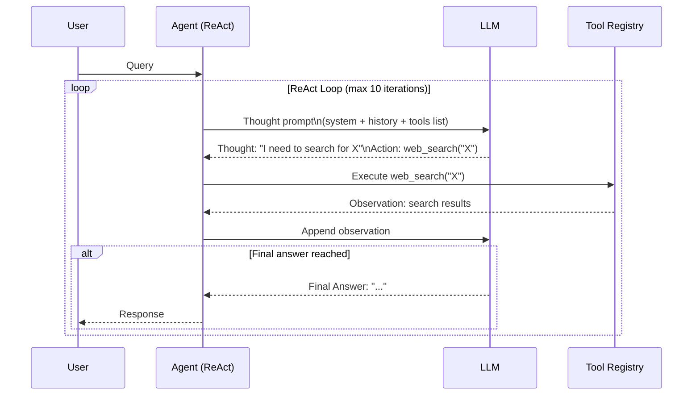

# Demo 03 — Tool-Using Agent

> A ReAct-style agent equipped with real-world tools: web search, a calculator, a weather API, and a sandboxed code executor.

---

## Overview

This demo showcases an agent that can **act on the world** using external tools. Rather than answering from training knowledge alone, the agent selects the appropriate tool for each step, executes it, observes the result, and reasons towards a final answer — a pattern known as **ReAct** (Reasoning + Acting).

Tools included in this demo:

| Tool | Description | API |
|------|-------------|-----|
| 🔍 Web Search | Search the internet for current information | SerpAPI |
| 🧮 Calculator | Evaluate mathematical expressions safely | Built-in |
| 🌤️ Weather | Get current weather for any city | OpenWeatherMap |
| 💻 Code Executor | Run Python code in a sandboxed environment | Docker / subprocess |

---

## Architecture



---

## What You'll Learn

- How to define custom tools in ADK using `@tool` decorator
- How the ReAct loop works: Thought → Action → Observation → repeat
- How to sandbox code execution for safety
- How to handle tool errors gracefully with fallback strategies
- How to control the ReAct loop with iteration limits and exit conditions

---

## Prerequisites

- Google ADK installed ([Getting Started](../../docs/GETTING_STARTED.md))
- `GOOGLE_API_KEY` set in your environment or `.env`
- Optional: `SERPAPI_KEY` for web search
- Optional: `OPENWEATHERMAP_API_KEY` for weather
- Optional: Docker for sandboxed code execution

---

## Setup

```bash
cd demos/03-tool-using-agent
pip install -r requirements.txt
cp .env.example .env
# Edit .env and add your API keys
```

---

## Running the Demo

```bash
adk run agent.py
```

---

## Example Interactions

**Multi-step reasoning with search + calculation:**

```
You: What is the population of Tokyo divided by the number of days in 2024?

Agent:
  Thought: I need Tokyo's population and the number of days in 2024.
  Action: web_search("Tokyo population 2024")
  Observation: Tokyo's population is approximately 13,960,000 (city proper).

  Thought: 2024 is a leap year, so it has 366 days.
  Action: calculator("13960000 / 366")
  Observation: 38142.62

  Final Answer: Tokyo's population divided by the number of days in 2024
  is approximately 38,143 people per day.
```

**Code execution:**

```
You: Write and run Python code to compute the first 10 Fibonacci numbers.

Agent:
  Thought: I'll write Python code and execute it.
  Action: code_executor("""
    def fib(n):
        a, b = 0, 1
        for _ in range(n):
            yield a
            a, b = b, a + b
    print(list(fib(10)))
  """)
  Observation: [0, 1, 1, 2, 3, 5, 8, 13, 21, 34]

  Final Answer: The first 10 Fibonacci numbers are: 0, 1, 1, 2, 3, 5, 8, 13, 21, 34
```

---

## Project Structure

```
03-tool-using-agent/
├── agent.py                 ← ADK agent with tools registered
├── tools/
│   ├── web_search.py        ← SerpAPI web search tool
│   ├── calculator.py        ← Safe math expression evaluator
│   ├── weather.py           ← OpenWeatherMap tool
│   └── code_executor.py     ← Sandboxed Python executor
├── requirements.txt
├── .env.example
└── README.md
```

---

## Key Concepts

| Concept | Where to find it |
|---------|-----------------|
| Tool definition with `@tool` | `tools/web_search.py` |
| Argument validation | `tools/calculator.py` — `validate_expression()` |
| Sandboxed execution | `tools/code_executor.py` — `DockerExecutor` |
| ReAct loop configuration | `agent.py` — `max_iterations=10` |
| Error handling & fallback | `agent.py` — `on_tool_error()` |

---

## Safety Features

The code executor tool runs user code in a **restricted sandbox**:

- Network access is disabled inside the sandbox
- File system access is limited to a temporary directory
- Execution is time-limited (default: 10 seconds)
- Memory usage is capped (default: 128 MB)

---

## Extending This Demo

- Add a **database query tool** (SQL via SQLAlchemy)
- Add a **file I/O tool** for reading and writing local files
- Add a **calendar tool** for scheduling-related queries
- Implement **parallel tool execution** for independent tool calls
- Add a **tool selection confidence score** to skip low-confidence actions

---

## Related Demos

- [Demo 01 — Multi-Agent Orchestration](../01-multi-agent-orchestration/) — uses this pattern in the Code Agent
- [Demo 05 — Autonomous Research Agent](../05-autonomous-research-agent/) — uses web search tools extensively
