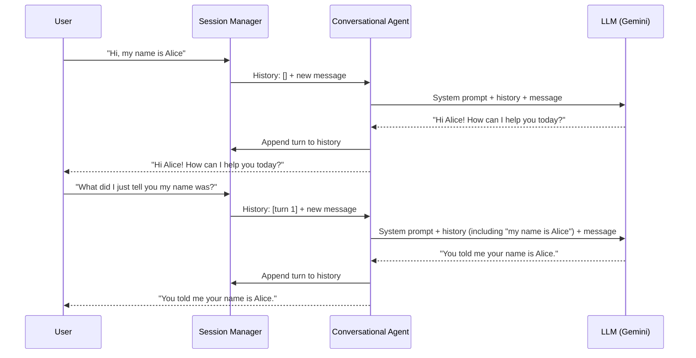

# Demo 04 — Conversational Agent

> A stateful, multi-turn chat agent with persistent session memory, a configurable persona, and smooth natural language dialogue.

---

## Overview

This demo is the **best starting point** for anyone new to ADK. It showcases a conversational agent with three key properties:

1. **Stateful** — remembers the full conversation history within a session
2. **Persona-driven** — its name, personality, and expertise are defined in the system prompt
3. **Contextually aware** — references earlier parts of the conversation naturally

Use this as a foundation for building customer support bots, tutors, coding assistants, or any other dialogue-based application.

---

## Architecture



---

## What You'll Learn

- How ADK manages conversation history and session state
- How to write effective system prompts that define persona and behaviour
- How to handle context window limits with conversation summarisation
- How to implement graceful conversation reset and session management
- How to stream tokens for a responsive user experience

---

## Prerequisites

- Google ADK installed ([Getting Started](../../docs/GETTING_STARTED.md))
- `GOOGLE_API_KEY` set in your environment or `.env`
- No additional API keys required ✅

---

## Setup

```bash
cd demos/04-conversational-agent
pip install -r requirements.txt
cp .env.example .env
# Edit .env and add your GOOGLE_API_KEY
```

---

## Running the Demo

**Web UI (recommended for new users):**

```bash
adk run agent.py
# Opens http://localhost:8000 in your browser
```

**Terminal mode:**

```bash
adk run --no-ui agent.py
```

---

## Example Interaction

```
You: Hi! I'm learning Python and struggling with list comprehensions.

Agent: Hi there! Great to meet you! List comprehensions are one of Python's
most elegant features. Let me explain them step by step.

The basic syntax is:
  [expression for item in iterable if condition]

For example, to get all even numbers from 1 to 10:
  evens = [x for x in range(1, 11) if x % 2 == 0]
  # Result: [2, 4, 6, 8, 10]

Would you like to try an exercise?

You: Yes please!

Agent: Great! Here's a challenge:

  Write a list comprehension that takes a list of strings and returns
  only the strings with more than 5 characters.

  words = ["hello", "world", "python", "ai", "agent"]

Take your time and share what you come up with!

You: [x for x in words if len(x) > 5]

Agent: Almost perfect! You've got the right idea. The result would be
["python", "agent"] — both have more than 5 characters. Well done! 🎉

One small note: you'd typically write it with a variable assignment:
  long_words = [x for x in words if len(x) > 5]

Ready for the next challenge?
```

---

## Project Structure

```
04-conversational-agent/
├── agent.py            ← ADK conversational agent
├── persona.py          ← System prompt / persona configuration
├── session.py          ← Session management utilities
├── requirements.txt
├── .env.example
└── README.md
```

---

## Key Concepts

| Concept | Where to find it |
|---------|-----------------|
| System prompt / persona | `persona.py` — `SYSTEM_PROMPT` |
| Session state management | `session.py` — `SessionManager` |
| Context window trimming | `agent.py` — `trim_history()` |
| Token streaming | `agent.py` — `stream=True` |
| Session reset | `agent.py` — `/reset` command |

---

## Persona Customisation

Edit `persona.py` to change the agent's name, personality, and expertise:

```python
SYSTEM_PROMPT = """
You are Aria, a friendly and patient Python tutor with 10 years of
teaching experience. You explain concepts clearly with examples, ask
follow-up questions to check understanding, and celebrate student
progress with genuine enthusiasm.

Guidelines:
- Use simple language; avoid jargon unless you explain it
- Always include a runnable code example
- End responses with an engaging follow-up question
"""
```

---

## Extending This Demo

- Add **long-term memory** using a vector store to remember facts across sessions
- Add **user profiles** to personalise responses based on skill level
- Add **voice input/output** using the Web Speech API or Google TTS
- Add **conversation export** to save chat history as Markdown or PDF
- Integrate with a **database** to answer questions about specific data

---

## Related Demos

- [Demo 01 — Multi-Agent Orchestration](../01-multi-agent-orchestration/) — adds delegation on top of conversation
- [Demo 03 — Tool-Using Agent](../03-tool-using-agent/) — adds external tools to a conversational base
