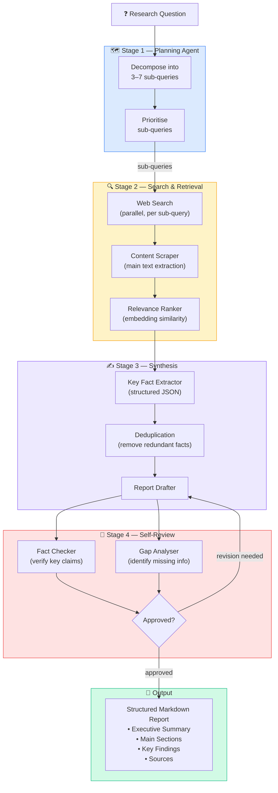

# Demo 05 — Autonomous Research Agent

> Give it a question. Get back a structured research report — no human in the loop.

---

## Overview

This is the **most advanced demo** in the repository. Given any research question, this agent autonomously:

1. **Plans** — decomposes the question into targeted sub-queries
2. **Searches** — executes web searches for each sub-query
3. **Reads** — scrapes and extracts relevant content from search results
4. **Synthesises** — combines findings into a coherent narrative
5. **Reviews** — self-critiques the draft for gaps and factual inconsistencies
6. **Outputs** — produces a structured Markdown report with citations

The agent operates **end-to-end without any human intervention**, demonstrating long-horizon autonomous task completion.

---

## Architecture



---

## What You'll Learn

- How to implement a **multi-stage autonomous pipeline** with ADK
- How to use **parallel tool execution** for independent web searches
- How to implement **self-review and self-correction** loops
- How to generate structured outputs (JSON → Markdown report)
- How to manage long-running agent tasks with **progress callbacks**

---

## Prerequisites

- Google ADK installed ([Getting Started](../../docs/GETTING_STARTED.md))
- `GOOGLE_API_KEY` set in your environment or `.env`
- `SERPAPI_KEY` for web search (free tier: 100 searches/month)

---

## Setup

```bash
cd demos/05-autonomous-research-agent
pip install -r requirements.txt
cp .env.example .env
# Edit .env and add your GOOGLE_API_KEY and SERPAPI_KEY
```

---

## Running the Demo

```bash
adk run agent.py
```

Or from the command line with a direct question:

```bash
python run_research.py --question "What are the latest developments in
multimodal large language models as of 2024?"
```

---

## Example Output

**Input:**
```
Research question: What are the key differences between RAG and fine-tuning
for adapting LLMs to specific domains?
```

**Output report** (`reports/output_20241209_143022.md`):

```markdown
# RAG vs. Fine-Tuning: Adapting LLMs to Specific Domains

**Research completed:** 2024-12-09 | **Sources:** 12 | **Confidence:** High

## Executive Summary

Retrieval-Augmented Generation (RAG) and fine-tuning represent two
complementary approaches to adapting large language models...

## 1. Core Concepts

### Retrieval-Augmented Generation (RAG)
RAG combines a frozen LLM with an external knowledge retrieval system...

### Fine-Tuning
Fine-tuning modifies the LLM's weights through continued training...

## 2. Comparison

| Dimension | RAG | Fine-Tuning |
|-----------|-----|------------|
| Knowledge update | Real-time | Requires retraining |
| Cost | Low (inference) | High (training) |
| Hallucination risk | Lower (grounded) | Higher |
| Latency | Higher | Lower |
| Custom behaviour | Limited | Extensive |

## 3. Key Findings

- RAG is preferred when knowledge changes frequently...
- Fine-tuning excels when style/format adaptation is needed...

## Sources

[1] Lewis et al. (2020) — "Retrieval-Augmented Generation for
    Knowledge-Intensive NLP Tasks" — https://arxiv.org/abs/2005.11401
[2] ...
```

---

## Project Structure

```
05-autonomous-research-agent/
├── agent.py                  ← Main ADK pipeline agent
├── stages/
│   ├── planner.py            ← Sub-query decomposition
│   ├── searcher.py           ← Parallel web search
│   ├── scraper.py            ← Content extraction
│   ├── synthesiser.py        ← Fact extraction + drafting
│   └── reviewer.py           ← Self-review + gap analysis
├── run_research.py           ← CLI entry point
├── reports/                  ← Generated reports (git-ignored)
├── requirements.txt
├── .env.example
└── README.md
```

---

## Key Concepts

| Concept | Where to find it |
|---------|-----------------|
| Multi-stage pipeline | `agent.py` — `ResearchPipeline` |
| Parallel search | `stages/searcher.py` — `asyncio.gather()` |
| Structured extraction | `stages/synthesiser.py` — JSON schema prompt |
| Self-review loop | `stages/reviewer.py` — `review_and_revise()` |
| Report generation | `stages/synthesiser.py` — `render_report()` |
| Progress callbacks | `agent.py` — `on_stage_complete()` |

---

## Configuration

| Parameter | Default | Description |
|-----------|---------|-------------|
| `MAX_SUB_QUERIES` | `5` | Maximum number of sub-queries to generate |
| `MAX_SEARCH_RESULTS` | `3` | Search results to fetch per sub-query |
| `MAX_REVIEW_ITERATIONS` | `2` | Maximum self-review cycles |
| `REPORT_FORMAT` | `markdown` | Output format (`markdown`, `html`, `json`) |
| `REPORTS_DIR` | `./reports` | Directory to save generated reports |

---

## Extending This Demo

- Add a **citation verifier** that checks if claimed URLs actually support the stated fact
- Add **domain-specific search** (e.g., arXiv for academic papers, PubMed for medical)
- Add **multi-modal research** — analyse images, charts, and diagrams from web results
- Build a **web UI** with Streamlit to show real-time progress through the pipeline stages
- Add **scheduled research** to run reports daily on a topic and email diffs

---

## Related Demos

- [Demo 02 — RAG Agent](../02-rag-agent/) — local document retrieval (complements web search)
- [Demo 03 — Tool-Using Agent](../03-tool-using-agent/) — foundational tool-use patterns used here
- [Demo 01 — Multi-Agent Orchestration](../01-multi-agent-orchestration/) — the multi-stage pipeline here is a sequential variant of orchestration
