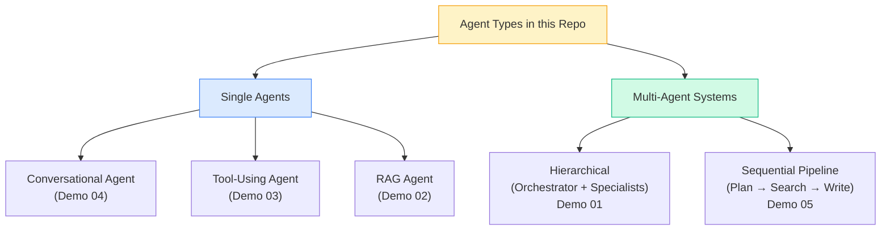
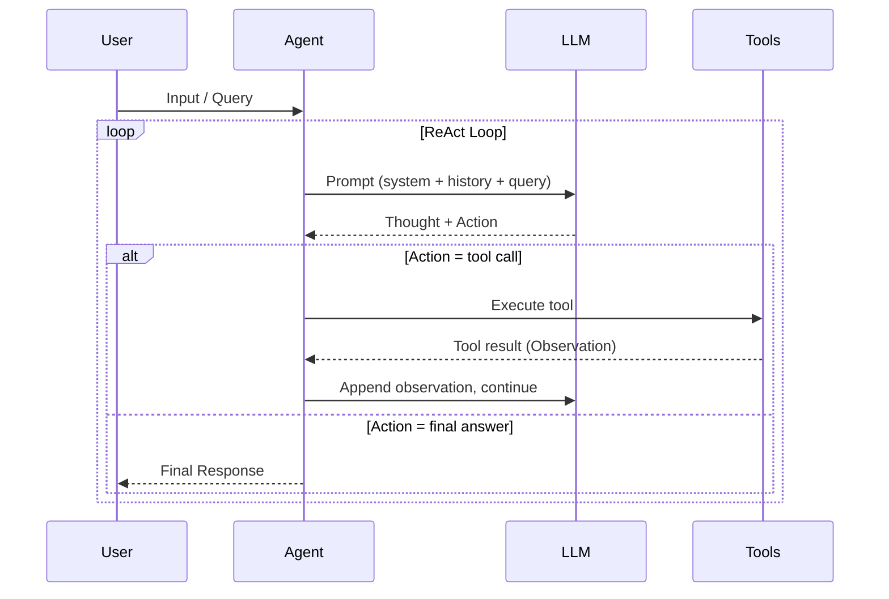
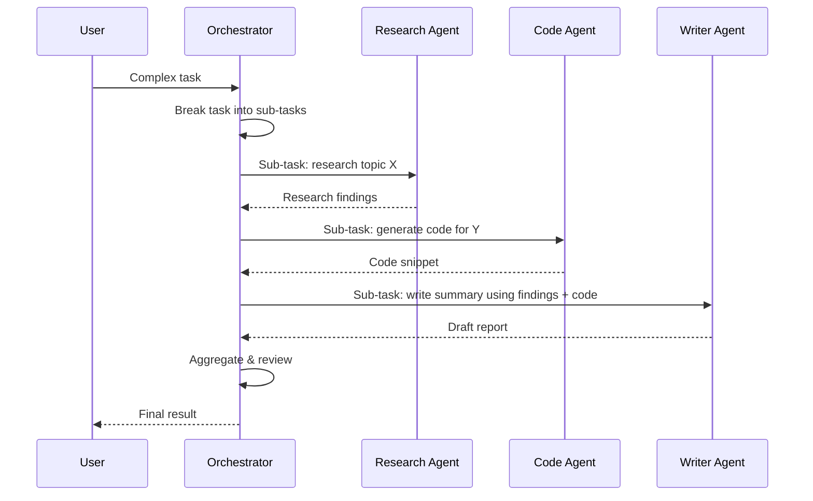
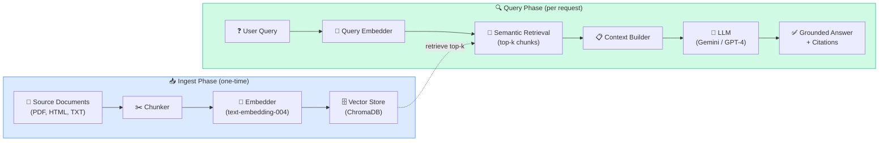
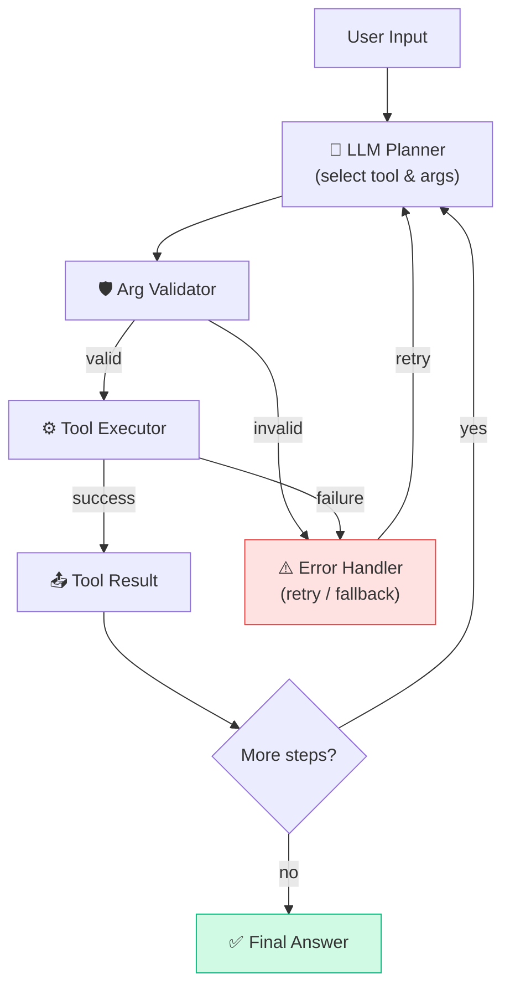
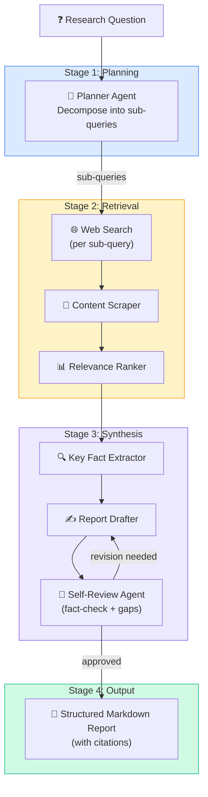
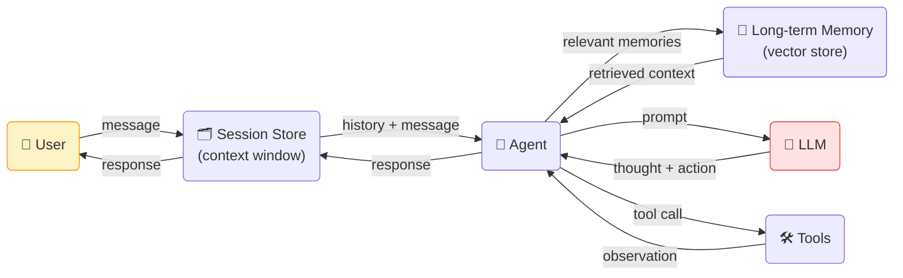

# 🏗️ Architecture

This document describes the system-level architecture of the NW Agentic Demos repository, including component design, data flow, and the reasoning behind key design decisions.

---

## Table of Contents

- [Repository Philosophy](#repository-philosophy)
- [Shared Infrastructure](#shared-infrastructure)
- [Agent Taxonomy](#agent-taxonomy)
- [Component Diagrams](#component-diagrams)
  - [Core Agent Loop](#core-agent-loop)
  - [Multi-Agent Communication](#multi-agent-communication)
  - [RAG Pipeline](#rag-pipeline)
  - [Tool Execution Flow](#tool-execution-flow)
  - [Autonomous Research Pipeline](#autonomous-research-pipeline)
- [Data Flow](#data-flow)
- [LLM Provider Abstraction](#llm-provider-abstraction)
- [Memory & State Management](#memory--state-management)
- [Security Considerations](#security-considerations)

---

## Repository Philosophy

Each demo in this repository is designed around three core properties:

1. **Isolation** — Every demo is a standalone project with its own virtual environment, dependencies, and entry point. You can understand and run any demo without reading the others.
2. **Transparency** — Agents log every reasoning step, tool call, and intermediate result so you can follow the agent's "thought process" from input to output.
3. **Composability** — The patterns demonstrated can be combined. The multi-agent orchestration demo, for example, internally uses the RAG agent and the tool-using agent as specialist sub-agents.

---

## Shared Infrastructure

Although demos are self-contained, they share a conceptual infrastructure that maps to this ADK-based stack:

```
┌─────────────────────────────────────────────────────────────────────┐
│                        Shared Concepts                              │
│                                                                     │
│  ┌───────────────┐  ┌───────────────┐  ┌────────────────────────┐  │
│  │  LLM Provider │  │  Tool Library │  │  Session / Memory Mgr  │  │
│  │  Abstraction  │  │  (ADK Built-  │  │  (In-memory + optional │  │
│  │  (swap easily)│  │   in + custom)│  │   persistent store)    │  │
│  └───────────────┘  └───────────────┘  └────────────────────────┘  │
│                                                                     │
│  ┌───────────────┐  ┌───────────────┐  ┌────────────────────────┐  │
│  │  Logging &    │  │  .env Config  │  │  Evaluation Harness    │  │
│  │  Tracing      │  │  Management   │  │  (ADK evals)           │  │
│  └───────────────┘  └───────────────┘  └────────────────────────┘  │
└─────────────────────────────────────────────────────────────────────┘
```

---

## Agent Taxonomy



---

## Component Diagrams

### Core Agent Loop

All agents in this repo follow the standard ReAct (Reasoning + Acting) loop:



---

### Multi-Agent Communication

Demo 01 uses a **hub-and-spoke** topology where the orchestrator delegates to specialist agents:



---

### RAG Pipeline

Demo 02 follows a standard RAG architecture with an ingest phase and a query phase:



---

### Tool Execution Flow

Demo 03 demonstrates how the agent selects and executes tools safely:



---

### Autonomous Research Pipeline

Demo 05 is the most complex — a fully autonomous multi-stage pipeline:



---

## Data Flow



---

## LLM Provider Abstraction

All demos use ADK's model abstraction, allowing you to swap providers by changing a single config value:

```python
# Gemini (default)
agent = Agent(model="gemini-2.5-flash")

# OpenAI
agent = Agent(model="openai/gpt-4o")

# Anthropic
agent = Agent(model="anthropic/claude-3-5-sonnet")
```

The abstraction layer normalizes:
- Message formatting (system, user, assistant roles)
- Tool/function calling schemas
- Streaming response handling
- Token counting & context window management

---

## Memory & State Management

```
┌─────────────────────────────────────────────────────────┐
│                   Memory Hierarchy                      │
│                                                         │
│  ┌─────────────────────────────────────────────────┐   │
│  │  In-Context Memory (shortest-lived)             │   │
│  │  Current conversation turns in the prompt       │   │
│  └─────────────────────────────────────────────────┘   │
│                          ▼                              │
│  ┌─────────────────────────────────────────────────┐   │
│  │  Session Memory (session-scoped)                │   │
│  │  ADK session store — persists across turns      │   │
│  └─────────────────────────────────────────────────┘   │
│                          ▼                              │
│  ┌─────────────────────────────────────────────────┐   │
│  │  Long-term Memory (persistent)                  │   │
│  │  Vector DB — semantic retrieval across sessions │   │
│  └─────────────────────────────────────────────────┘   │
└─────────────────────────────────────────────────────────┘
```

---

## Security Considerations

| Concern | Mitigation |
|---------|-----------|
| Prompt injection | Input sanitisation + system prompt hardening |
| Tool misuse | Argument validation before every tool call |
| Code execution | Sandboxed executor (Docker / restricted subprocess) |
| API key exposure | Keys loaded from `.env` only, never hardcoded |
| Excessive LLM calls | Max iteration limits on all ReAct loops |
| Data leakage | No PII stored in vector DBs in demos |

---

> 📌 For implementation details, read the README in each demo directory.
